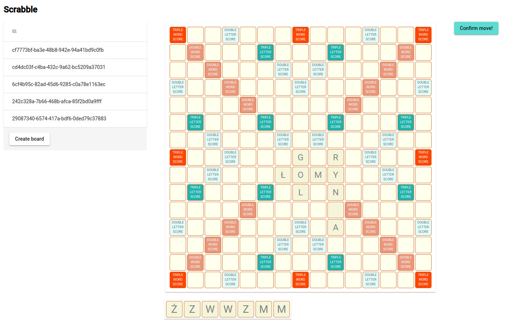

# Docker commands:

## Run mongo db:
```
sudo docker run -d --hostname my-mongo --name mongo -p 27017:27017 mongo:6
```

## Run mongo-express admin:
```
sudo docker run --network="host" -e ME_CONFIG_MONGODB_SERVER=localhost -p 8081:8081 mongo-express
```

## Screen:

