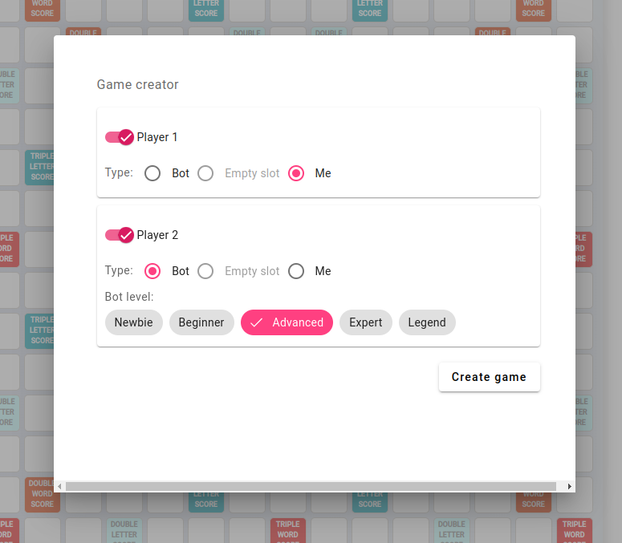
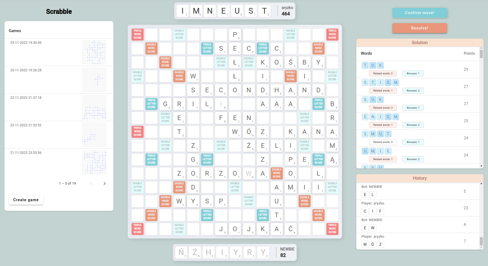

## Description

Scrabble game implemented using a microservices architecture. Technology stack: Spring (backend), Angular (frontend).

You can create a game with the computer or with yourself. The computer has five levels of difficulty. In the game, there is a functionality for suggesting words (currently unlimited suggesting in every round).

### Used technologies/libraries:

#### Backend Technologies
| Category  | Technologies                                                                                                                       |
|-----------|------------------------------------------------------------------------------------------------------------------------------------|
| Spring    | Spring Boot, Spring Security, Spring AMQP, Spring Cloud (Contract, Gateway, OpenFeign)                                             |
| Eureka    | Eureka Server, Eureka Client                                                                                                       |
| Databases | MongoDB (Mongock), PostgreSQL (Liquibase), H2 Database                                                                             |
| Others    | Keycloak, Caffeine, RabbitMQ, MapStruct, Lombok, Springdoc-openapi, Logbook, Resilience4j, Vavr, Archunit, WebSockets, Reflections |

#### Frontend Technologies
| Technology | Details                      |
|------------|------------------------------|
| Angular    | Angular Material, NgRx, RxJS |

## Deployment Options

---

### Option 1: Using Docker Compose

This method uses Docker Compose to orchestrate the deployment of all services.

#### Steps to Launch Using Docker Compose

1. **Update `hosts` file**: Add the following line to your `/etc/hosts` (Linux) or `C:\Windows\system32\drivers\etc\hosts` (Windows) file to ensure the proper functioning of Keycloak:

```
127.0.0.1 keycloak
```

This step is necessary to correctly resolve the Keycloak hostname in your local environment.

2. **Start the Containers**: Run the following command to start all required services defined in `docker-compose.yml`:

```
docker-compose up -d
```

3. **Service Checks**: After starting the services, ensure that all containers are running correctly.
4. **Configure Keycloak**: Before using the application, configure Keycloak as follows:
- **Realm**: Create a new realm named `scrabble`.
- **Client**: Create a client named `scrabble`.
  - **Valid Redirect URIs**: Set to `http://localhost:4200/*`.
  - **Web Origins**: Set to `http://localhost:4200`.
  - **Authentication Flow**: Use the standard flow.
- **Create a System User**: Set up a default user for system-level access with the following credentials:
  - Login: `scrabble-user`
  - Password: `scrabble-password`
- **Create Your Own User**: Additionally, it's important to create your personal user account for accessing the application.
5. **Accessing Applications**: Use the URLs provided below to access the different components of the application.

### Helpful Docker Commands:
- To stop all services: `docker-compose down`
- To view the status of containers: `docker-compose ps`

---

### Option 2: Manual Docker Image Setup

This method involves manually running individual Docker images.

#### [AMQP] RabbitMQ for Scrabble Board Manager and Scrabble Dictionary. To provide messaging services:

```
docker run -d --network="host" --name rabbitmq_3_12 -p 5672:5672 -p 15672:15672 rabbitmq:3.12-management
```

#### [SECURITY] Keycloak for All Applications. To handle security and authentication:

```
docker run -d --name keycloak -p 8086:8080 -e KEYCLOAK_ADMIN=admin -e KEYCLOAK_ADMIN_PASSWORD=admin quay.io/keycloak/keycloak:23.0.1 start-dev
```

Preparation:
- **Realm**: Create a new realm named `scrabble`.
- **Client**: Create a client named `scrabble`.
  - **Valid Redirect URIs**: Set to `http://localhost:4200/*`.
  - **Web Origins**: Set to `http://localhost:4200`.
  - **Authentication Flow**: Use the standard flow.
- **Create a System User**: Set up a default user for system-level access with the following credentials:
  - Login: `scrabble-user`
  - Password: `scrabble-password`
- **Create Your Own User**: Additionally, it's important to create your personal user account for accessing the application.

#### [DB] MongoDB for Scrabble Board Manager and Scrabble Tile Manager. For NoSQL database services:

```
docker run -d --hostname my-mongo --name mongo -p 27017:27017 mongo:6
```

#### [DB] PostgreSQL for Scrabble Dictionary and Scrabble Game. For SQL database services:

```
docker run -d --hostname my-postgres --name postgres -e POSTGRES_PASSWORD=mysecretpassword -p 5432:5432 postgres:15
```

Preparation:
- db name for scrabble-dictionary: dictionary
- db name for scrabble-game: game

#### [ADMIN] Mongo-Express Admin (Optional). For database management and monitoring (optional):


```
docker run -d --network="host" --name mongo-express -e ME_CONFIG_MONGODB_SERVER=localhost -p 8081:8081 mongo-express
```

#### Final Step: Launch All Applications
After setting up the necessary Docker images, start each of the microservices individually.

---

### URLs:
| App           | URL                                         |
|---------------|---------------------------------------------|
| ui            | http://localhost:4200/                      |
| game-service  | http://localhost:8087/swagger-ui/index.html |
| mongo-express | http://localhost:8081                       |

### Game creator:


### Game:


