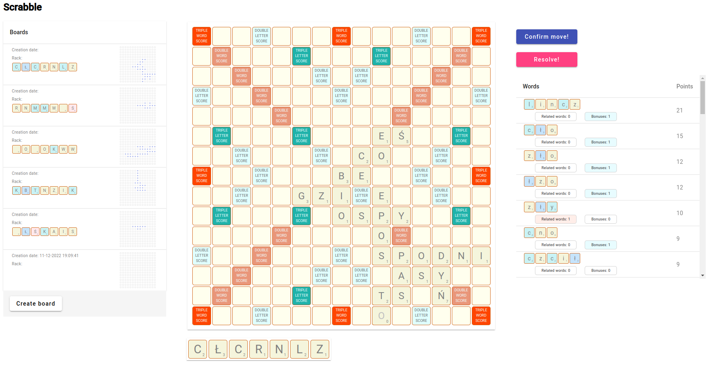
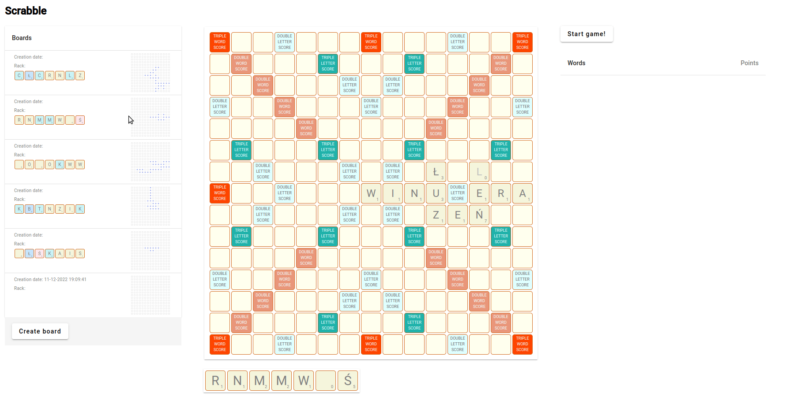

## Docker commands to execute before starting applications:

### [SECURITY] Run keycloak for all apps
```
docker run -d --name keycloak -p 8086:8080 -e KEYCLOAK_ADMIN=admin -e KEYCLOAK_ADMIN_PASSWORD=admin quay.io/keycloak/keycloak:20.0.1 start-dev
```
Preparation:
- Realm: scrabble
- Client: scrabble
  - Valid redirect URIs: http://localhost:4200/*
  - Web origins: http://localhost:4200
  - Authentication flow: standard flow

### [DB] Run mongo db for scrabble-board-manager, scrabble-tile-manager:
```
docker run -d --hostname my-mongo --name mongo -p 27017:27017 mongo:6
```

### [DB] Run postgres for scrabble-dictionary, scrabble-game:
```
docker run -d --hostname my-postgres --name postgres -e POSTGRES_PASSWORD=mysecretpassword -p 5432:5432 postgres:15
```
Preparation:
- db name for scrabble-dictionary: dictionary
- db name for scrabble-game: game

### [ADMIN] Run mongo-express admin (optional):
```
docker run -d --network="host" --name mongo-express -e ME_CONFIG_MONGODB_SERVER=localhost -p 8081:8081 mongo-express
```

### URLs:
| App           | URL                                         |
|---------------|---------------------------------------------|
| ui            | http://localhost:4200/                      |
| game-service  | http://localhost:8087/swagger-ui/index.html |
| mongo-express | http://localhost:8081                       |

### Screen:



### Board resolver:

