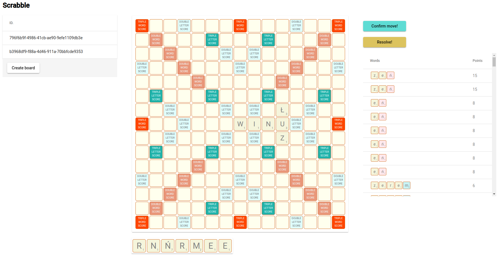
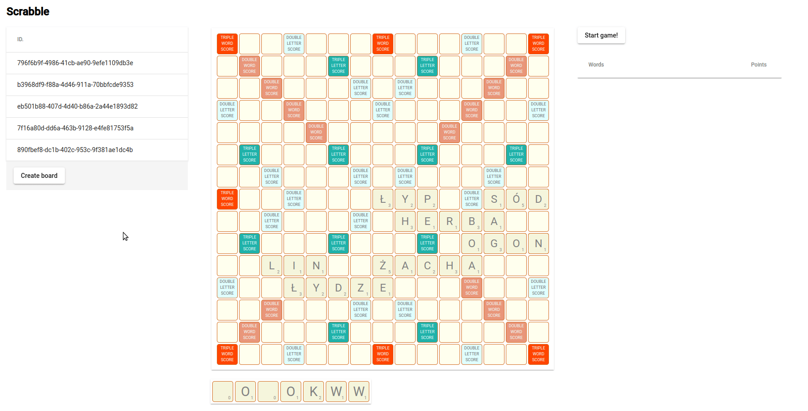

## Docker commands to execute before starting applications:

### [DB] Run mongo db for scrabble-board-manager, scrabble-tile-manager:
```
sudo docker run -d --hostname my-mongo --name mongo -p 27017:27017 mongo:6
```

### [DB] Run postgres for scrabble-dictionary:
```
sudo docker run -d --hostname my-postgres --name postgres -e POSTGRES_PASSWORD=mysecretpassword -p 5432:5432 postgres:15
```

### [ADMIN] Run mongo-express admin (optional):
```
sudo docker run -d --network="host" --name mongo-express -e ME_CONFIG_MONGODB_SERVER=localhost -p 8081:8081 mongo-express
```

### Screen:



### Board resolver:

